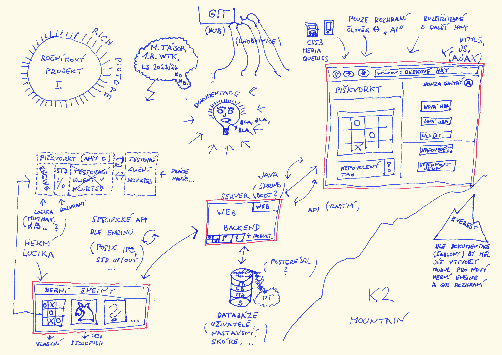
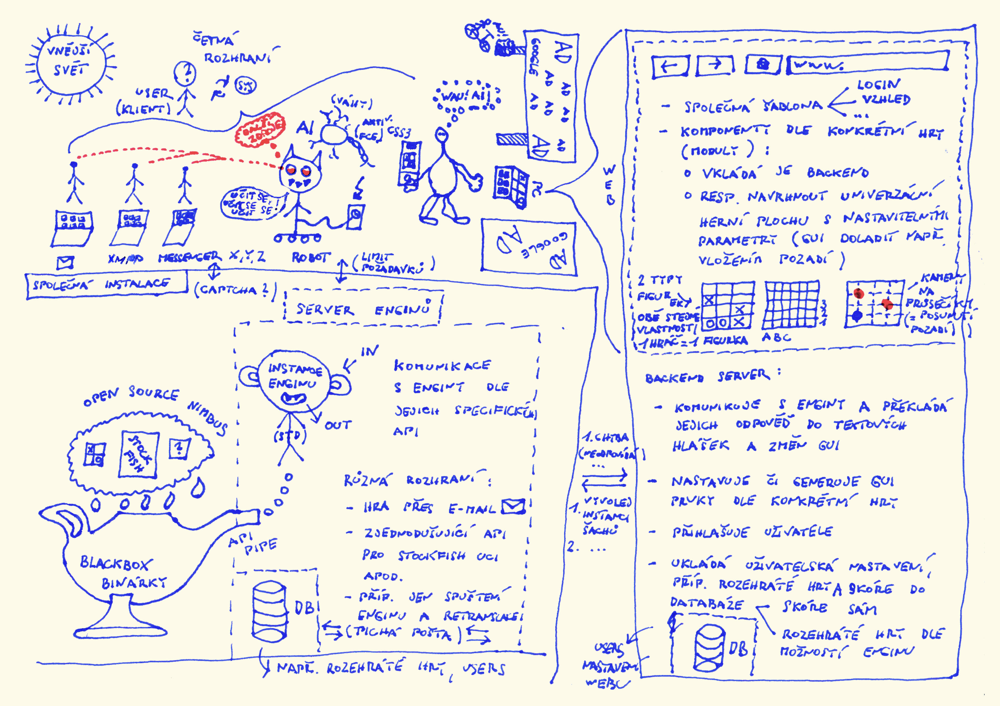

```text
/*
 * autor:
 *     jméno     :  Martin TÁBOR
 *     kontakt   :  st72836@student.upce.cz
 *     škola     :  UPCE - FEI
 *     obor      :  Webové technologie (Bc., komb.)
 *
 * předmět:
 *     název     :  Ročníkový projekt I. (KRPW1)
 *     semestr   :  2. | LS 2023/24
 *     vyučující :  Ing. Lukáš Čegan, Ph.D.
/*
```

# Popis konceptu: Webové rozhraní pro enginy deskových her

> Základní myšlenkou je realizace webového GUI pro hraní deskových (tahových) her.


*Koncept (rich picture)*

## Úvod

Deskové tahové hry s **úplnou znalostí pozic** jsou již dlouho předmětem zájmu informatiků i výpočetních úloh superpočítačů při katedrách matematiky.
Prakticky využívané **algoritmy** se v průběhu času mění a zlepšují na základě vzrůstajícího výpočetního výkonu CPU, GPU, NPU, rostoucích kapacit pamětí, ale i na základě nových přístupů a trendů, kam dnes můžeme zařadit techniky **strojového učení**. Základním principem hledání optimálního tahu již nemusí být prohledávání **stavového prostoru** hrubou silou a explicitně definované funkce modifikující &bdquo;strategii&ldquo;, ale např. autonomně vytrénovaný model na základě stovek či milionů odehrátých her proti soupeři (resp. konkurenční neuronové síti) s různými herními postupy.

## Architektura platformy


*Koncept (rich picture)*

Řešení herní logiky tedy nikdy není zcela triviální úkol a i u strategie založené kupříkladu na generování pseudonáhodných čísel musíme vyhodnocovat přípustnost tahů dle pravidel etc.
Architektura aplikace, by tedy měla tento fakt zohlednit &ndash; **oddělením herní logiky** a rozhraní určeného pro informování člověka o aktuálním stavu hry a jeho interakci s počítačem.

**Základní funkce z pohledu uživatele**

1. hra jednoho hráče proti AI (enginu běžícímu na serveru)
2. *(volitelně)* hra dvou uživatelů webu proti sobě

### Herní enginy

V roce 1997 poprvé porazil počítač **IBM Deep Blue** mistra světa Garriho Kasparova v šachu. Od té doby uběhlo již hodně času a velmi obstojným šachystou se může stát téměř jakýkoliv notebook či smartphone prostou instalací šachového programu &ndash; optimálně tzv. šachového enginu.

**Šachový engine** je většinou vysoce výkonná a sofistikovaná aplikace, která zpracovává herní logiku &ndash; v základě jako vstup přijímá různé povely typu *nová hra*, *tah: a2 na a4* a vrací odpověd v podobě zprávy nebo tahu zamýšleného počítačem. Dnes je k dispozici velké množství kvalitních open source projektů, které se nezaměřují jen na šachy, ale i jiné deskové hry v podobě piškvorek, go atd.

Open source projekty:
- **Stockfish**: jeden z nejlepších a nejznámnějších šachových enginů &ndash; multiplatformní, komunikuje přes standardizované API &ndash; UCI (Universal Chess Interface), velké množství grafických klientů
- **&hellip;**

### Koncept projektu

Projekt by měl být rozdělen na čtyři základní komponenty (položky implementované v rámci projektu **tučně**):

1. herní enginy (logika hry | platformě závislý | offline) &ndash; *využití Stockfish nebo vlastní **pokus o engine piškvorek***
2. **server enginů** (engine <-> klient | online) &ndash; *zřejmě Java (REST API, e-mail, XMPP (Jabber), &hellip;)*
3. **webová aplikace**
   - web/backend (server enginu, DB&hellip; <-> frontend | online) &ndash; *zřejmě Java*
   - web/frontend (komunikace s backendem | online)

## Důvod volby tématu

Projekt zahrnuje oblasti z mnoha profilujících předmětů studijního oboru Webové technologie a vhodně je propojuje do uceleného aplikovaného řešení (produktu):
- Operační systémy &ndash; IPC komunikace *herní engine* <-> *server enginu*
- Tvorba webových aplikací &ndash; Java pro backend
- World Wide Web &ndash; frontend
- Databázové systémy &ndash; backend webové aplikace
- Programování a algoritmizace, matematický blok &ndash; obecně
- &hellip;

Mnohovrstevnatá architektura platformy nemusí být nutně nejefektivnější &ndash; daný typ her však neklade nároky na rychlost odezvy ani datovou propustnost. Z didaktického pohledu navíc umožní pochopit a procvičit problematiku různorodých oblastí a při správné implementaci (návrhu jednotlivých komponent) udělat produkt modulární a teoreticky zčásti publikovatelný jako open source &ndash; každá z komponent nicméně poslouží k otestování ostatních.
