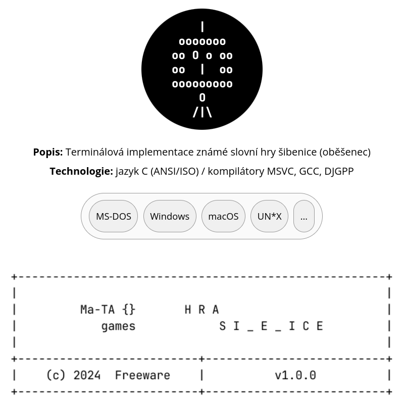

- koncept1&nbsp;&ndash;&nbsp;Webové rozhraní pro enginy deskových her,
- koncept2&nbsp;&ndash;&nbsp;Výuka psaní na klávesnici,
- prokrastinace&nbsp;&ndash;&nbsp;Hra Šibenice (*případová studie* nasazení &bdquo;old-school&rdquo; hry v jazyce C na webu)
  
