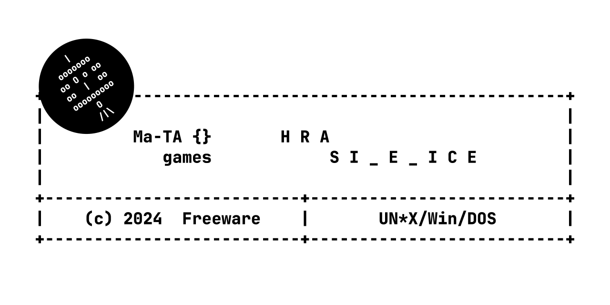

# Hra Š I _ E _ I C E

*Původním záměrem bylo vytvoření multiplatformní &bdquo;retro&rdquo; hry pro platformy
od MS-DOS,  UN\*X,  WINDOWS až po webové prohlížeče za využití technologie
WebAssembly (resp. emscripten.org)&nbsp;&ndash;&nbsp; zde je problém se soubory a vstupem
uživatele, vyžadující zřejmě rozsáhlejší úpravu programu.*

*Alternativou může být webová stránka využívající rozhraní CGI&nbsp;&ndash;&nbsp;
metoda POST se z hlediska programu jeví jako data na standardním vstupu,
zatímco k datům zaslaným přes GET lze přistupovat přes proměnnou prostředí QUERY_STRING.
Výstupy by bylo třeba opatřit HTTP hlavičkou (příp. i několika HTML tagy)&nbsp;&ndash;&nbsp;
výstupy programu však nejsou centralizovány např. přes jednu funkci/makro (nelze upravovat všechna
místa v kódu, např. vč. záměny znaku '\n' za \<br\>!.
Dále by bylo třeba vyřešit udržení stavu programu a nespouštět program stále znovu&nbsp;&ndash;&nbsp;
web by možná mohl komunikovat se zvláštním CGI skriptem, který by byl prostředníkem mezi hrou
a httpd.*

### Popis a stručné instrukce
Známá slovní hra (alias Oběšenec, Hangman) založená na hádání jednotlivých písmen tajného slova.
Program je napsán v jazyce ANSI (ISO) C a pro jeho sestavení by neměly být třeba žádné nestandardní knihovny.

- **[Základní instrukce k sestavení](how_make.txt)**
- [Nápověda ke hře](res/napoveda.txt)
- [Známé chyby a nápady na další vývoj](res/poznamky.txt)

### Binárky ke stažení

- **[All-in-1 řešení ZIP](https://github.com/ma-ta/BTWA1/releases/download/v1.0.0/sibenice_1.0.0_bin.zip)**
- [Složka s binárkami](bin/)

#### Pro systémy typu MS-DOS
V případě zobrazení hlášky *"Load error: no DPMI - Get csdpmi\*.zip"* umístěte soubor [CWSDPMI.EXE](/bin/CWSDPMI.EXE) do stejného adresáře jako spustitelný soubor hry. Více o problematice např. [zde](//en.wikipedia.org/wiki/CWSDPMI) nebo [zde](https://sandmann.dotster.com/cwsdpmi/).

#### Testované platformy *(kompilátory)*:
- UN*X:
  - Ubuntu 24.04 LTS *(GNU GCC 13.2.0) – [x86_64]*
  - FreeBSD 14 *(LLVM/Clang 16.0.6) – [x86_64]*
- MS Windows:
  - Windows 11 *(MSVC 19.40.33808) – [x86][x86_64]*
- DOS:
  - FreeDOS 1.3 *(DJGPP 4.7.1)*
  - DOSBox 0.74-3
  - MS-DOS 6.22

### Snímky obrazovky

- [Všechny dostupné screenshoty zde](res/screenshots)

Hlavní menu:

Obrazovka hry:

Herní statistiky:

Obrazovka hry (DOS – 25x80 znaků):

Informace o verzi (DOS):

