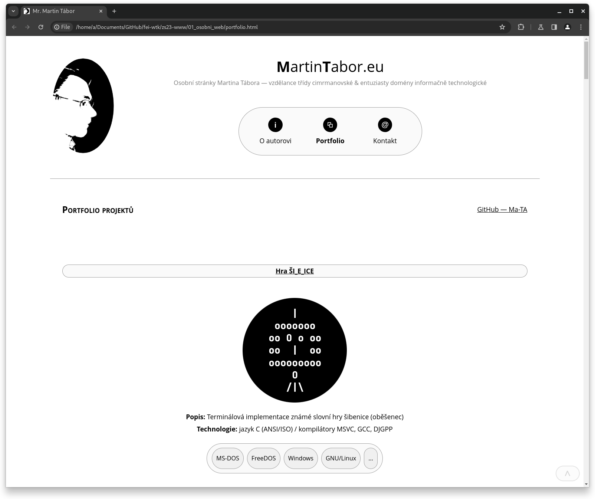
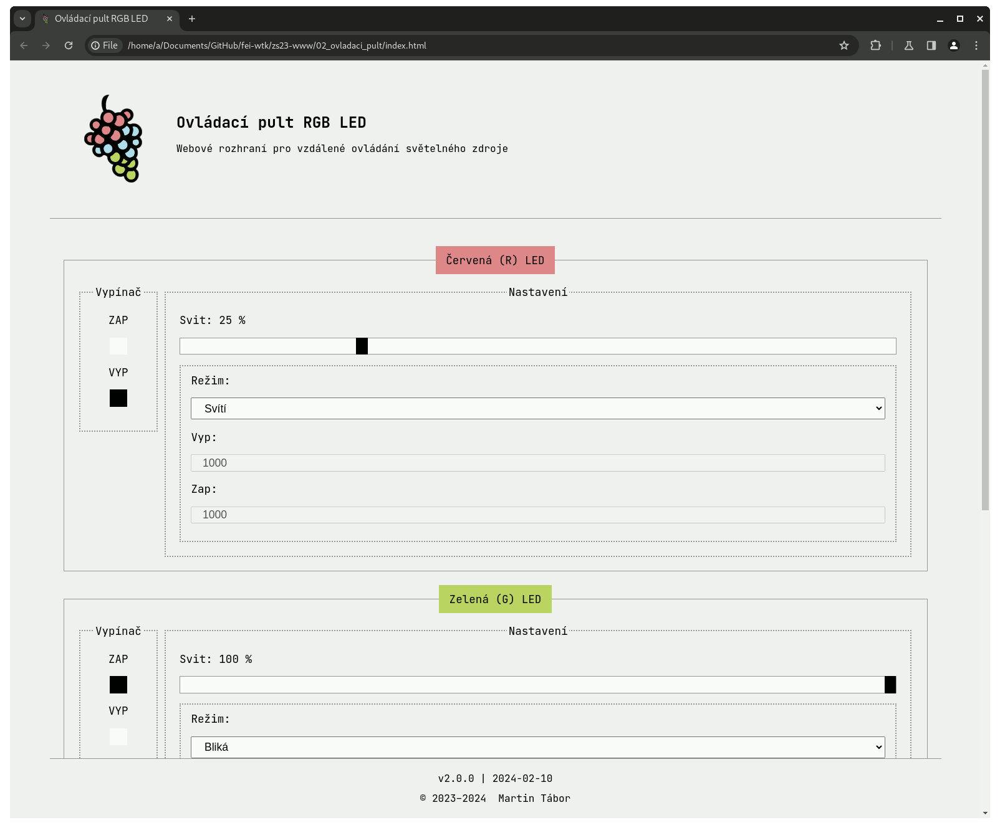

```text
/*
 * autor:
 *     jméno     :  Martin TÁBOR
 *     kontakt   :  st72836@student.upce.cz
 *     škola     :  UPCE - FEI
 *     obor      :  Webové technologie (Bc., komb.)
 *
 * předmět:
 *     název     :  World Wide Web (KWWW)
 *     semestr   :  1. | ZS 2023/24
 *     vyučující :  Ing. Lukáš Čegan, Ph.D.
/*
```

## Zápočet: vypracování semestrální práce (front end webové aplikace)

### 01 Osobní web

**v1.0.0 (požadavky u zápočtu dne 2024-01-10):**
1. Hlavní menu bude responzivní na jednom řádku (horizontální)
2. Doplnit stránku s portfoliem dosavadních projektů

**v2.0.0 (final):**



### 02 Ovládací pult

**v1.0.0 (požadavky u zápočtu dne 2024-01-10):**
1. Table-less layout

**v2.0.0 (final):**


